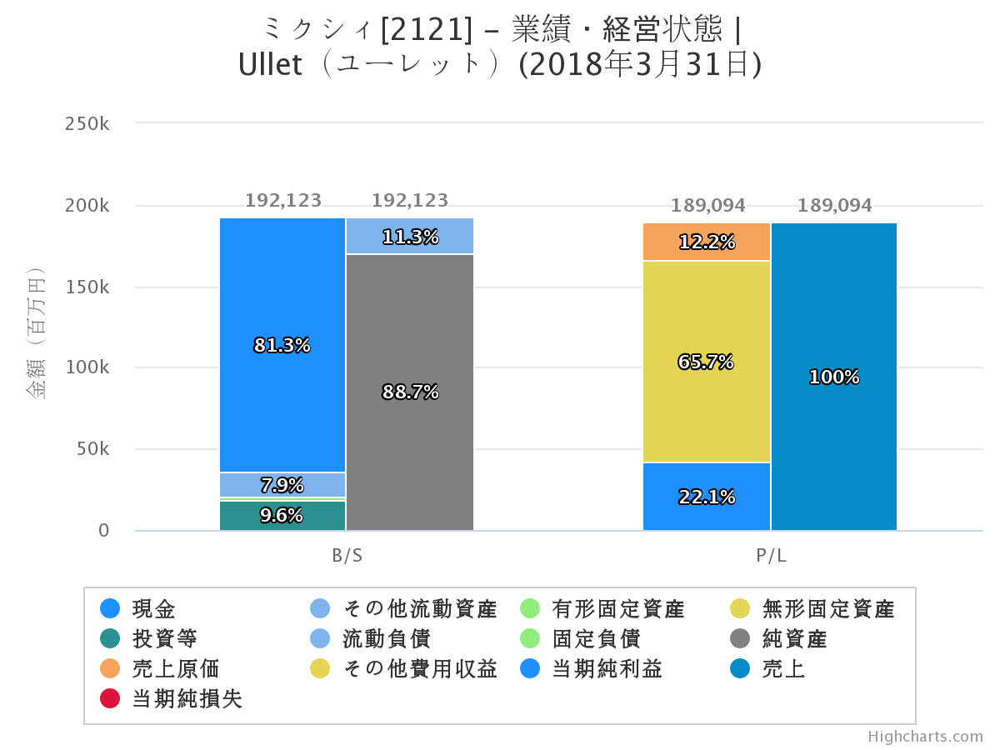

株式会社ミクシィ
==

### 企業名

株式会社ミクシィ

### 代表者名

木村 弘毅

- 2008年入社、2015年社長就任
- モンスターストライクプロジェクト立ち上げ

### 本社住所

東京都渋谷区東1-2-20 住友不動産渋谷ファーストタワー7F

https://goo.gl/maps/4VVCoSzUZB32

### 有価証券報告書

https://ssl4.eir-parts.net/doc/2121/yuho_pdf/S100DF8L/00.pdf

### 財務諸表

### 設立

1997年

### 事業内容

- エンターテインメント事業
  - [ファイトリーグ](https://fight-league.com/)
  - [モンスターストライク](https://www.monster-strike.com/)
  - [モンスターストライク スタジアム](https://www.stadium.monster-strike.com/)
  - [XFLAG STORE](https://store.xflag.com/)
- ライフスタイル事業
  - [家族アルバム みてね](https://mitene.us/)
  - [minimo](https://minimodel.jp/)
  - [mixi](https://mixi.jp/)
  - [KARASTA](https://karasta.net/)
  - [Find Job!](http://www.find-job.net/)
  - [ココサイズ](https://cococise.com/)

### 関連会社

- [株式会社ミクシィ・リクルートメント](http://www.mixi-recruitment.co.jp/)
  - 企業と求職者をマッチングするプラットフォーム「Find Job !」を提供
- [株式会社スマートヘルス](https://smart-health.co.jp/)
  - 女性専用コンディショニングスタジオ「ココサイズ」を運営
- アイ・マーキュリーキャピタル株式会社
  - 投資事業、ミクシィグループにおける投資実行支援を展開
- 株式会社ミクシィ・エンパワーメント
  - 「障害者の雇用の促進等に関する法律(障害者雇用促進法)」に基づく株式会社ミクシィの特例子会社
- mixi America, Inc.
  - 北米を中心とした自社サービスのマーケティング、アライアンス事業を展開

### 業界での位置付け

### 経営理念

#### 理念／ステートメント

- ユーザーサプライズファースト
  - 我々のサービスの先にいる顧客（ユーザー）に対して 常に真摯に応えるはもちろんのこと、さらに想像や期待を超える価値を 「コミュニケーションサービス」を通じて提供していきます。

#### やるべきこと／ミッション

- フォー・コミュニケーション
  - これまでになかったつながりを作るため。 考え抜いた先に閃いたアイデアを さまざまな技術革新に乗せてユーザーに届ける。 おどろきとよろこびを持って受け入れてもらう。 それが、大きなうねりを生み出し、世界中へ拡がっていく。 コミュニケーションを通じて世界を鮮やかに変えていく。 それが、わたしたちミクシィグループです。

#### 行動指針／バリュー

- 誠実に真摯に
  - どんな時、場面でも、高潔・誠実・真摯であること。 仕事を行う上で、社内外はもちろん、 ユーザーに対しても持ち続けなければならないもの。 その強い意思を込めた言葉です。
- 創造し続ける
  - 頭の中には無限の宇宙がある。 一人ひとり、個々人がサービスを創っていくこと。 新しいものを生み出すために、自分の頭で考え続け かつてない発想に到達して、実行していくこと。 そんな我々の思いを込めた言葉です。
- 最初に行動
  - 新しいことを最初に考え、立ち上げ、広める者。 環境や時代の変化を洞察して、 ユーザーのためにいち早く行動できる人間。 我々のありたい姿を表現した言葉です。
- 全てを包み込む
  - カルチャーや考え方が違う仲間がいても、 個性を大切にし、それを包み込み、よりよく昇華していく。 我々の個性豊かな姿を表現した言葉です。

### 使用する技術

- インフラ
  - AWS・GCｐ
- サーバーサイド
  - Elixir、Ruby、Go
- クライアントサイド
  - cocos2d(モンスト)、Unity、Swift、Kotlin

### その他特徴

- 現金をたくさん持っている
- エンジニア主導での採用活動
- 勉強会や技術イベントも行っている
  - git challenge
  - Bug Shooting Challenge
  - TDD Challenge

### 求める人材像

- 柔軟に取り組み学ぶ
- 成し遂げたい強い思いがある
- 独自の工夫を加えて周囲を巻き込みながら行動する

### 雇用条件

- 月給30万円～
- 賞与は年2回 (6月、12月)
- フレックスタイム制（所定労働時間10:00～19:00）
  - コアタイム 10:00〜15:00
  - フレキシブルタイム 6:00〜10:00, 15:00〜22:00
- 住宅手当(渋谷駅から届出住所まで直線3km以内の方に月3万円の補助)、転居費用補助、交通費支給
- ミクシィブレイク(リフレッシュ休暇/インセンティブ支給)
- マッサージルーム、ランチ代サポート(お弁当購入代補助、軽食販売など)、ドリンクバー完備
- 懇親会補助
- iTunes/Google Playカード購入補助
- 完全週休2日制 (土曜・日曜)、祝日

### 関心のある点

- 日本で一番売り上げのあるタイトルの運営を行っている点
- 技術的なアウトプットを会社として行っている点
- 外部の人間に対しても誠実であること
- アプリで閉じない新たなゲームの領域を模索している点

### 長所との接点

- 新しいことを始めることが出来る
- 柔軟に様々な技術を学べる
- 周りの人間を選び、頼ることが出来る
- ゲーム業界を活性化するためのビジョンがある

### 実際に話して分かったこと

### 最近の話

### その他

- [Xflag Tech Note](https://career.xflag.com/report/uploads/XFLAG%20Tech%20Note.pdf)
- [Xflag Tech Note #2](https://speakerdeck.com/mixi_engineers/xflag-tech-note-vol-dot-02)